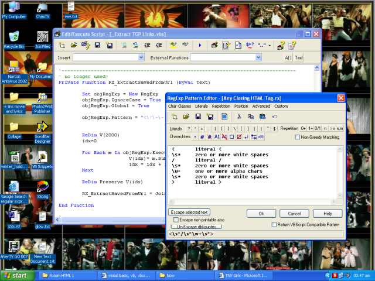



## VBScript Editor \+ Regular Expression Editor

### Description

VBScript Editor + Regular Expression Editor

a very good source on how to use the powerful Script Control, also provides a comprehensive RegExp editor, this code is part of a larger project called Axiom (there is an *older* version here on psc if u r interested) and i didn't spend much time cleaning it so ther is code that's not used here and could be removed...blah blah blah....
 
### More Info
 

             |
---                |---
**Submitted On**   |2004-12-17 05:38:26
**By**             |[M\. J\. Highlander](https://github.com/Planet-Source-Code/PSCIndex/blob/master/ByAuthor/m-j-highlander.md)
**Level**          |Advanced
**User Rating**    |5.0 (25 globes from 5 users)
**Compatibility**  |VB 6\.0
**Category**       |[Complete Applications](https://github.com/Planet-Source-Code/PSCIndex/blob/master/ByCategory/complete-applications__1-27.md)
**World**          |[Visual Basic](https://github.com/Planet-Source-Code/PSCIndex/blob/master/ByWorld/visual-basic.md)
**Archive File**   |[VBScript\_E18319812212004\.zip](https://github.com/Planet-Source-Code/m-j-highlander-vbscript-editor-regular-expression-editor__1-57843/archive/master.zip)

